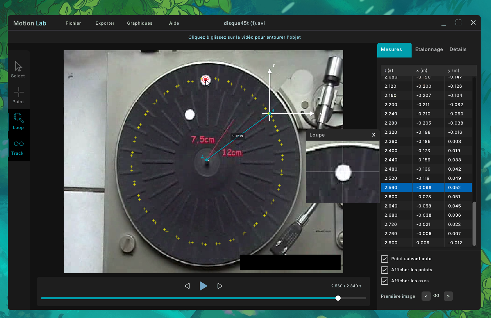
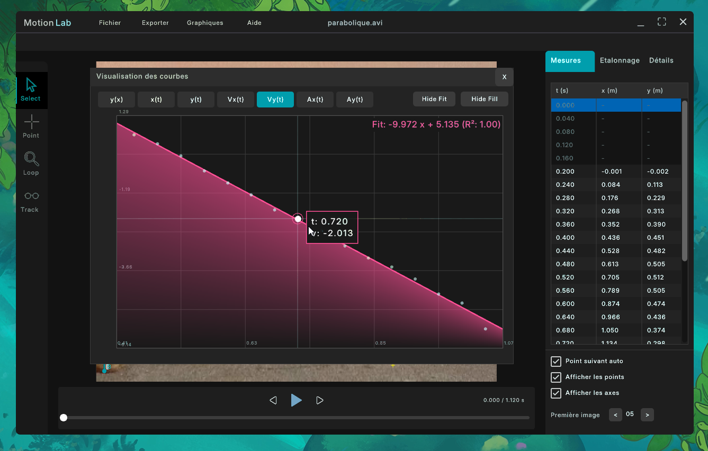
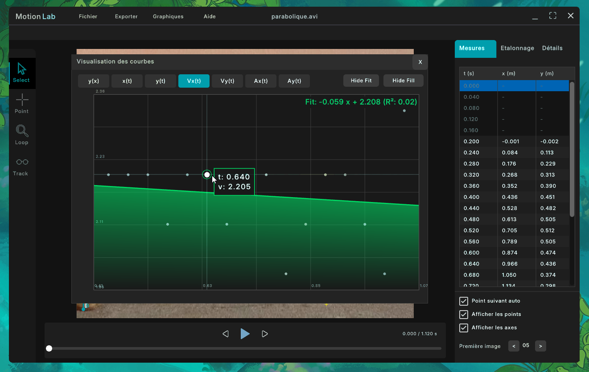

# MotionLab - Analyse de Mouvement par Vidéo


For English version, see [README_EN.md](README_EN.md)

**MotionLab** est une solution moderne de pointage vidéo et d'analyse cinématique conçue pour l'enseignement et la recherche en physique. Utilisant **OpenCV** pour le suivi d'objet et la légèreté de **Raylib** pour l'interface, il offre une alternative rapide, fluide et intuitive aux logiciels traditionnels.



> ℹ️  MotionLab permet de basculer entre le français et l’anglais depuis le menu **Aide**.

---

## 🚀 Pourquoi MotionLab ?

MotionLab a été créé pour corriger les frustrations courantes liées aux logiciels de pointage dits "historiques",
dont l’ergonomie et les contraintes techniques ne sont pas toujours en phase avec les usages actuels.


* **Modernité et Fluidité** : Rendu hardware accéléré par le GPU via OpenGL. L'interface reste réactive à 60 FPS, même avec des milliers de points de données.
* **Compatibilité Vidéo Universelle** : Grâce à l'intégration de **FFmpeg**, MotionLab décode quasiment tous les formats (`.mp4`, `.mkv`, `.mov`, `.avi`) et les codecs modernes (H.264, H.265), là où d'autres se limitent au `.avi` non compressé.
* **Simplicité "Drag & Drop"** : Importez une vidéo, calibrez l'échelle en deux clics, et commencez l'analyse immédiatement.
* **Zéro Limite** : Aucune restriction artificielle sur la résolution (4K supportée) ou la durée des vidéos traitées.
* **Cross-Platform** : Fonctionne sur Linux et Windows (MacOS devrait marcher aussi, théoriquement. Empiriquement… à confirmer.)
* **Aucune Télémétrie, Aucun Suivi** : MotionLab ne collecte, n’enregistre et ne transmet absolument aucune donnée d’usage, statistique ou comportementale.

> MotionLab a été conçu pour s’effacer au profit de l’analyse physique,
et non l’inverse.

---

## 🤖 Système d'Auto-Tracking (CSRT)

MotionLab peut utiliser un module de suivi automatique basé sur l'algorithme **OpenCV CSRT** (Channel and Spatial Reliability Tracker).


### Avantages du suivi intelligent
Contrairement au simple "Template Matching" (recherche de pixels identiques), le tracker de MotionLab :
1.  **S'adapte aux déformations** : Si l'objet tourne ou change de perspective pendant le mouvement, le tracker met à jour son modèle visuel.
2.  **Résiste au bruit** : Un prétraitement **CLAHE** (Contrast Limited Adaptive Histogram Equalization) et un flou gaussien sont appliqués en temps réel pour stabiliser la détection.
3.  **Prédit la trajectoire** : En cas de perte de signal, le système utilise le dernier vecteur vitesse connu pour "prédire" la position et tenter de retrouver l'objet automatiquement.

### 💡 Bonnes pratiques d’utilisation

Pour de meilleurs résultats, il est fortement recommandé de démarrer l’auto-tracking lorsque l’objet est libre de tout contact, et que le mouvement est réellement engagé.
>(Le tracker cherche une balle, pas une main.)

### ⚠️ Limitations techniques
Bien que performant, l'auto-tracking rencontre des limites inhérentes à la vision par ordinateur :
* **Occlusions totales** : Si l'objet disparaît derrière un obstacle, le suivi s'arrête.
* **Flou de mouvement (Motion Blur)** : Les objets se déplaçant trop vite par rapport à l'obturateur de la caméra peuvent devenir impossibles à identifier.
* **Contraste faible** : Un objet de couleur identique au fond (ex: bille blanche sur fond blanc) peut entraîner des décrochages.


---

## 📊 Analyse Scientifique et Graphiques

### Précision des mesures
Pour minimiser le bruit numérique lors des calculs de dérivation, MotionLab utilise la méthode de la **différence centrale** :
$$v_i = \frac{x_{i+1} - x_{i-1}}{t_{i+1} - t_{i-1}}$$


### Modélisation (Best Fit)
L'outil graphique intègre un moteur de régression permettant de superposer des courbes de tendance avec calcul automatique du coefficient $R^2$ :
* **Linéaire** : $f(t) = a \cdot t + b$
* **Quadratique** : $f(t) = a \cdot t^2 + b \cdot t + c$



---

## 🏗️ Structure du Projet

```text
MotionLab/
├── include/           # Headers (.h)
├── src/               # Code source (.c, .cpp)
│   ├── video_engine.c # Moteur de décodage FFmpeg et gestion du temps
│   ├── auto_tracker.cpp # Wrapper OpenCV : logique CSRT et vision
│   ├── ui_graph.c     # Système de rendu des graphiques (OpenGL/RLGL)
│   ├── ui_canvas.c    # Interaction avec la vidéo et les points
│   ├── tracking.c     # Calculs physiques (vitesse, accélération, étalonnage)
│   ├── resources.h    # Assets embarqués (Header généré)
│   └── ...            # Widgets UI (Menus, Tables, Inputs)
# Oui, il y a beaucoup de fichiers. Non, ils ne sont pas là par hasard.
├── assets/            # Icônes, polices et ressources système
└── CMakeLists.txt     # Script de compilation universel (Windows/Linux)
```
## ⚙️ Compilation

### Dépendances requises

- **Raylib** 5.0+
- **OpenCV** 4.x
- **FFmpeg** (avcodec, avformat, swscale)

### Build

Sur Windows (VS2022 / MinGW) : Assurez-vous que vos variables d'environnement pointent vers les libs ou utilisez vcpkg.
```bash
mkdir build && cd build
cmake .. -DCMAKE_BUILD_TYPE=Release
cmake --build .
```
Sur Linux (Ubuntu/Debian/Fedora) :
```
sudo apt install libraylib-dev libopencv-dev libavcodec-dev libavformat-dev libswscale-dev
mkdir build && cd build
cmake .. -DCMAKE_BUILD_TYPE=Release
make
```

## 📦 Gestion des Ressources (Assets)
Pour garantir la portabilité et faciliter la distribution, les assets (icônes, polices) sont embarqués directement dans le binaire.
>(parce que “ça marchait sur ma machine” n’est pas une stratégie de déploiement).

Bien que les fichiers sources soient visibles dans le dossier assets/, le logiciel utilise le fichier include/resources.h. Ce header contient les données binaires des fichiers converties en tableaux d'octets (unsigned char[]).

La génération de ce fichier a été automatisée via ce script
[generate_resources.py](https://gist.github.com/zerosh0/cce3d82cbc8c943db0d33abf1ea9d2a5)

## 📜 Licence

MotionLab est distribué sous la licence **GNU GPL v3**.  
Cela signifie que :

- Vous pouvez utiliser, modifier et redistribuer le logiciel librement.  
- Tout logiciel dérivé doit également rester **GPL** (open-source).  

